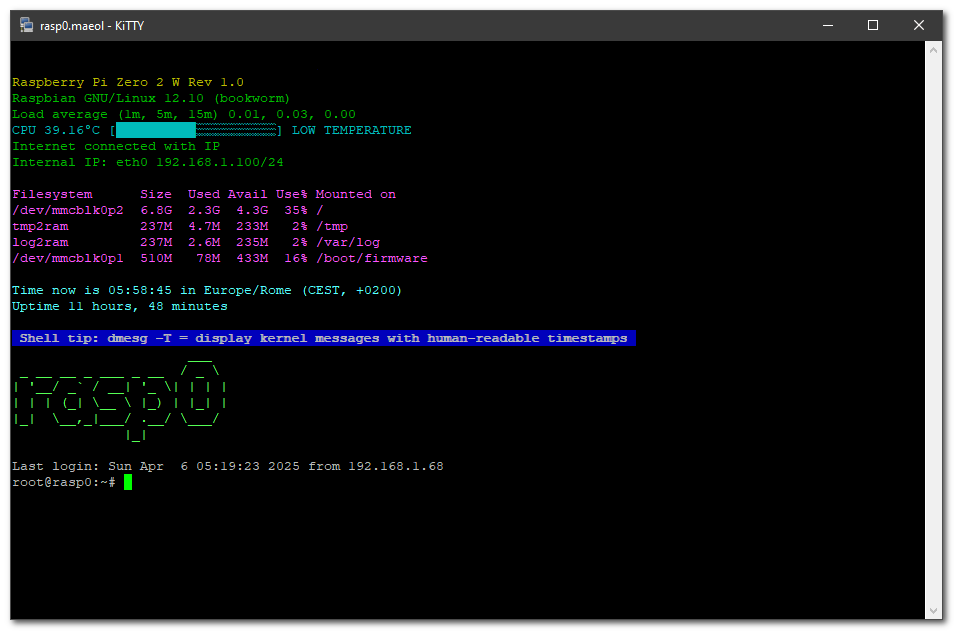
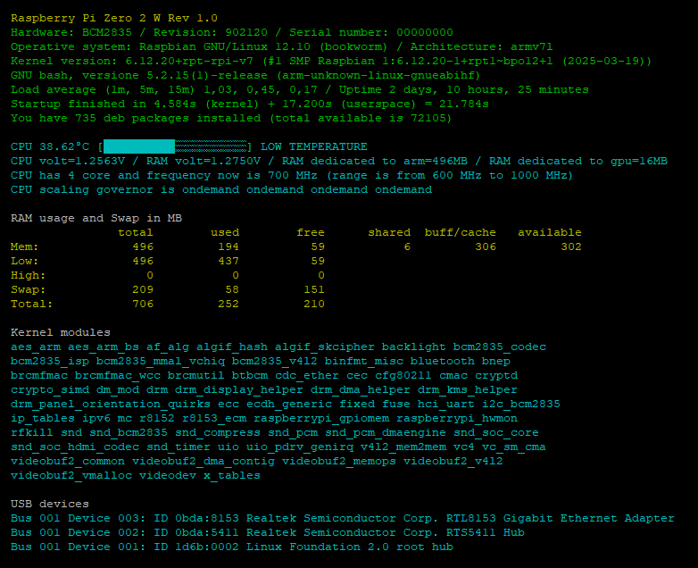
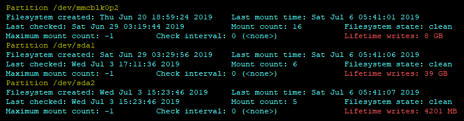
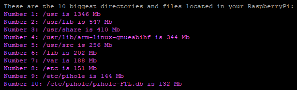
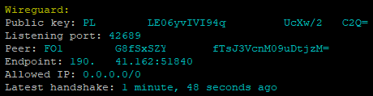
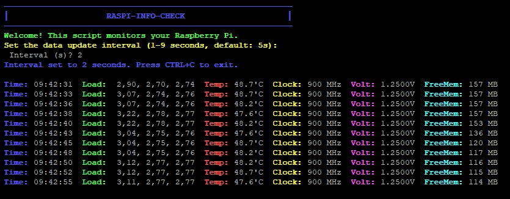
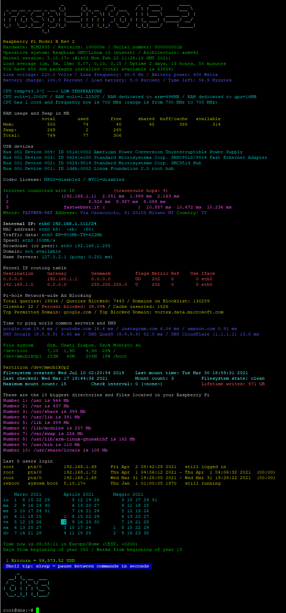

# raspi-info

**RASPI-INFO is a tool to get a lot of information about your Raspberry Pi.**

Discover the heartbeat of your Raspberry Pi with raspi-info! Unravel its mysteries as you explore system details, CPU performance, network efficiency, and more in a mesmerizing, colorful display. From direct shell usage to automatic execution on SSH login, raspi-info offers over 500 "shell tips" to assist you in bash!

  [🔍 Overview](#overview) •
  [🚀 Install](#install) •
  [🗑️ Uninstall](#uninstall) •
  [💻 Commands](#commands) •
  [📸 Screenshots ](#screenshots)

## 🔍 Overview <a name="overview"></a>
- **Direct Usage**: Use `raspi-info` or `raspi-info-light` from the shell.
- **Automatic Usage**: `raspi-info-light` starts automatically when you log in via SSH.
- **Shell Tips**: RASPI-INFO provides over 500 shell tips to assist you in bash.
- **Update Notifications**: You'll receive a message at the end of the program when a new update is available.

## 🚀 Install <a name="install"></a>
To install raspi-info, run the following command:
```bash
curl -sSfL https://raw.githubusercontent.com/mapi68/raspi-info/master/raspi-info-install | bash
```

## 🗑️ Uninstall <a name="uninstall"></a>
To uninstall raspi-info, run:
```bash
sudo apt --purge remove raspi-info -y
```

If you also want to remove installed dependencies, run:
```bash
sudo apt --purge autoremove raspi-info -y
```

## 💻 Commands <a name="commands"></a>
| Command                | Description                                                                 |
|------------------------|-----------------------------------------------------------------------------|
| **raspi-info**         | Main window with detailed information                                       |
| **raspi-info-light**   | Light version, starts by default on SSH login                               |
| **raspi-info-check**   | Simple tool to check real-time load, temperature, clock, and voltage        |
| **raspi-info-install** | Install raspi-info                                                          |
| **raspi-info-update**  | Update raspi-info                                                           |

## 📸 Screenshots <a name="screenshots"></a>

### raspi-info-light


### General Information


### Partition Information


### Folder Information


### WireGuard Information


### raspi-info-check


### raspi-info

