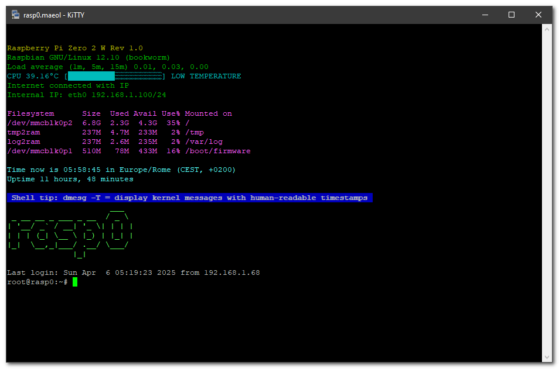
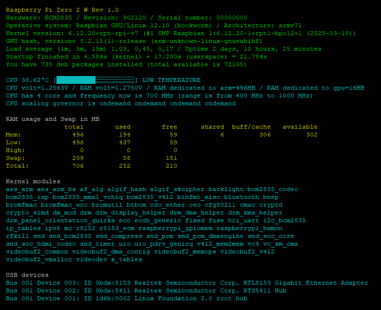
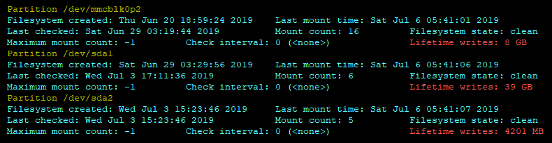
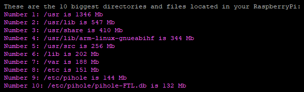
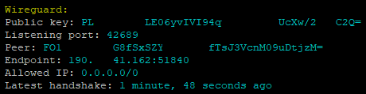
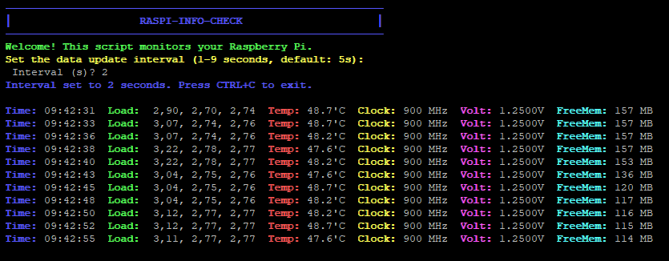
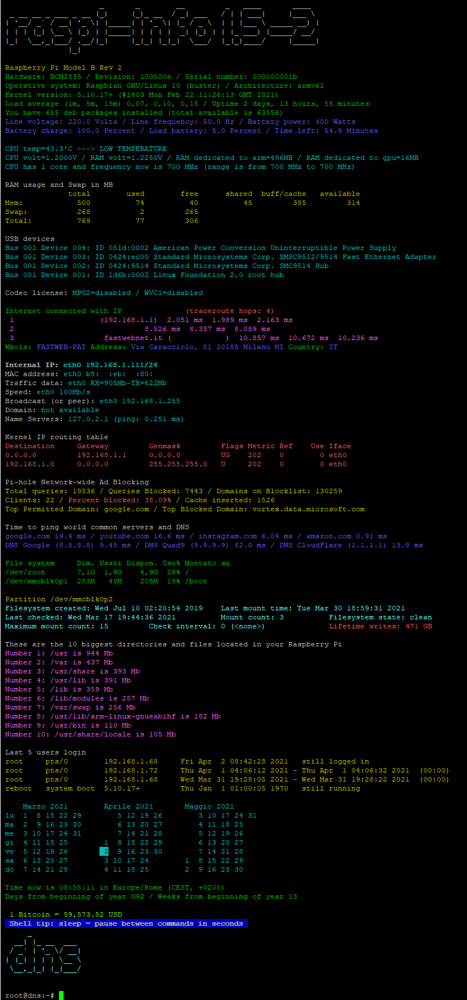

<p align="center">
  
</p>

<h1 align="center">raspi-info</h1>

<p align="center">
  <strong>The Swiss Army Knife for Unlocking Your Raspberry Pi's Secrets.</strong>
</p>

<p align="center">
  <a href="#overview">Overview</a> •
  <a href="#install">Install</a> •
  <a href="#commands">Commands</a> •
  <a href="#screenshots">Screenshots</a> •
  <a href="#uninstall">Uninstall</a>
</p>

<p align="center">
  <a href="https://ko-fi.com/mapi68">
    
  </a>
</p>

---

Tired of digging through multiple commands to understand your Raspberry Pi? **raspi-info** is a comprehensive tool that gathers a vast array of system information in one convenient place. From hardware details and OS specifics to network configurations, resource usage, and installed software — it's the essential utility for enthusiasts, developers, and anyone who wants a quick, clear overview of their Raspberry Pi's inner workings.

---

## 🔍 Overview <a name="overview"></a>

| Feature | Details |
|---|---|
| 🖥️ **Direct Usage** | Run `raspi-info` or `raspi-info-light` directly from the shell |
| 🔐 **Auto SSH Login** | `raspi-info-light` launches automatically on SSH login |
| 💡 **Shell Tips** | Over **500 bash shell tips** to boost your productivity |
| 🔔 **Update Notifications** | Get notified at program end when a new version is available |

---

## 🚀 Install <a name="install"></a>

Install raspi-info with a single command:

```bash
curl -sSfL https://raw.githubusercontent.com/mapi68/raspi-info/master/raspi-info-install | bash
```

> **Requirements:** Raspberry Pi running a Debian-based OS (e.g. Raspberry Pi OS).

---

## 💻 Commands <a name="commands"></a>

| Command | Description |
|---|---|
| `raspi-info` | Main window with full, detailed system information |
| `raspi-info-light` | Lightweight version — starts automatically on SSH login |
| `raspi-info-check` | Real-time monitor for load, temperature, clock, and voltage |
| `raspi-info-install` | Installer script for raspi-info |
| `raspi-info-update` | Update raspi-info to the latest version |

---

## 📸 Screenshots <a name="screenshots"></a>

### raspi-info-light
> Compact summary shown automatically at SSH login.



---

### General Information
> Hardware, OS, CPU, memory, and uptime at a glance.



---

### Partition Information
> Disk partitions, usage, and mount points.



---

### Folder Information
> Sizes of key directories on your system.



---

### WireGuard Information
> Status and configuration of active WireGuard VPN interfaces.



---

### raspi-info-check
> Real-time hardware metrics: load, temperature, clock speed, and voltage.



---

### raspi-info (full view)
> Complete system report in the main interface.



---

## 🗑️ Uninstall <a name="uninstall"></a>

To remove raspi-info:

```bash
sudo apt --purge remove raspi-info -y
```

To also remove installed dependencies:

```bash
sudo apt --purge autoremove raspi-info -y
```

---

## 📄 License

This project is licensed under the terms of the [LICENSE](LICENSE) file included in this repository.

---

## ☕ Support

If you find raspi-info useful, consider supporting the project:

<p align="center">
  <a href="https://ko-fi.com/mapi68">
    
  </a>
</p>

---

<p align="center">
  Made with ❤️ for the Raspberry Pi community
</p>
