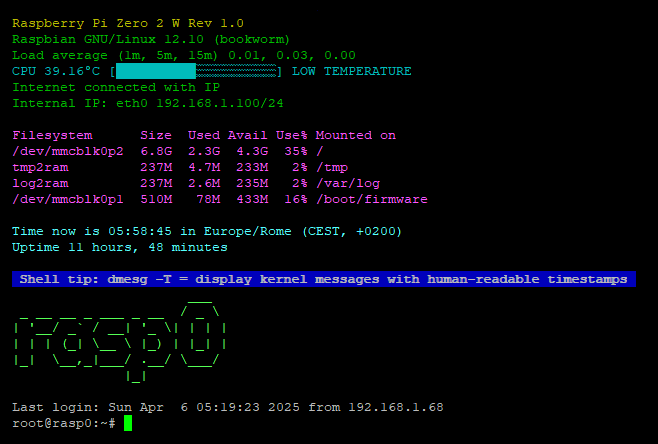
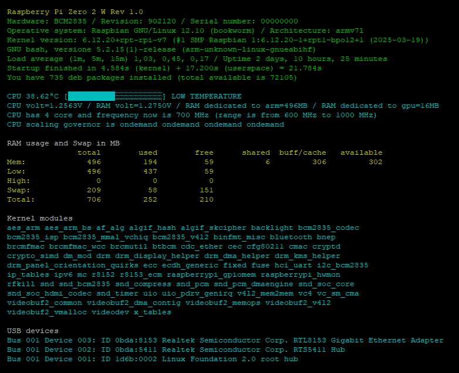

# raspi-info

**RASPI-INFO: The Swiss Army Knife for Unlocking Your Raspberry Pi's Secrets.**

Tired of digging through multiple commands to understand your Raspberry Pi? Raspi-info is a comprehensive tool designed to gather a vast array of information about your device in one convenient place. Think of it as your essential Swiss Army Knife for Raspberry Pi insights.

From hardware details and operating system specifics to network configurations, resource usage, and installed software, raspi-info provides a wealth of data to help you monitor, troubleshoot, and understand your Raspberry Pi. It's the perfect utility for enthusiasts, developers, and anyone who wants a quick and easy overview of their Raspberry Pi's inner workings.

## 🔍 Overview <a name="overview"></a>
- **Direct Usage**: Use `raspi-info` or `raspi-info-light` from the shell.
- **Automatic Usage**: `raspi-info-light` starts automatically when you log in via SSH.
- **Shell Tips**: RASPI-INFO provides over 500 shell tips to assist you in bash.
- **Update Notifications**: You'll receive a message at the end of the program when a new update is available.

## 🚀 Install <a name="install"></a>
To install raspi-info, run the following command:
```bash
curl -sSfL https://raw.githubusercontent.com/mapi68/raspi-info/master/raspi-info-install | bash
```

## 🗑️ Uninstall <a name="uninstall"></a>
To uninstall raspi-info, run:
```bash
sudo apt --purge remove raspi-info -y
```

If you also want to remove installed dependencies, run:
```bash
sudo apt --purge autoremove raspi-info -y
```

## 💻 Commands <a name="commands"></a>
| Command                | Description                                                                 |
|------------------------|-----------------------------------------------------------------------------|
| **raspi-info**         | Main window with detailed information                                       |
| **raspi-info-light**   | Light version, starts by default on SSH login                               |
| **raspi-info-check**   | Simple tool to check real-time load, temperature, clock, and voltage        |
| **raspi-info-install** | Install raspi-info                                                          |
| **raspi-info-update**  | Update raspi-info                                                           |

## 📸 Screenshots <a name="screenshots"></a>

### raspi-info-light


### General Information


### Partition Information


### Folder Information


### WireGuard Information


### raspi-info-check


### raspi-info

